# Chapter 14 — Atoms & Molecules: the Zoo's Family Tree

## Theory recap

Every architecture in this zoo is made of a small vocabulary of MECHANISMS.
An **elementary** model (an *atom*) introduces one irreducible mechanism —
remove it and the model stops being itself: convolution, self-attention,
adversarial training, iterative denoising, message passing, tree search…
A **derived** model (a *molecule*) composes mechanisms that already exist
and usually adds one refinement of its own (resnet = classifier + residual
connections; moe = transformer + routing; kimi = transformer + moe + mamba
+ four new tricks). A **composition** goes one level higher still: it wires
whole trained MODELS into a pipeline (latent diffusion = vae + diffusion;
guided diffusion = classifier/clip + diffusion; the VLM = vision encoder +
transformer LM).

The machine-readable source of truth is
`src/mini_networks/core/taxonomy.py` — `MODEL_TAXONOMY` (44 models:
`level`, `introduces`, `builds_on`), `MECHANISMS` (each atom's home file),
and `COMPOSITION_TAXONOMY` (21 pipelines). Sync tests keep it exact:
full registry coverage, acyclic DAG, every mechanism introduced exactly
once. Browse it from the terminal:

```bash
uv run python main.py list   # atoms, molecules, compositions — grouped
```

## The 16 atoms

| Atom | Mechanism | Home |
|---|---|---|
| classifier | convolution | models/classifier |
| tabular_classifier | mlp | models/tabular |
| rnn | recurrence | models/rnn |
| transformer | self-attention | models/transformer |
| mamba | selective-scan | models/mamba |
| gnn | message-passing | models/gnn |
| vae | variational-latent | models/vae |
| gan | adversarial-game | models/gan |
| diffusion | iterative-denoising | models/diffusion |
| pixelcnn | autoregressive-factorization | models/pixelcnn |
| segmentation | skip-encoder-decoder | models/segmentation |
| simclr | contrastive-infonce | models/simclr |
| reinforce | policy-gradient | models/reinforce |
| rl_maze | value-based-rl | models/rl_maze |
| nerf | neural-field-rendering | models/nerf |
| alphazero | tree-search-self-play | models/alphazero |

## The dependency DAG

Generated by `taxonomy.mermaid()` — regenerate after taxonomy changes with
`uv run python -c "from mini_networks.core.taxonomy import mermaid; print(mermaid())"`.
Double-boxed nodes are atoms; arrows read "is built on by".

```mermaid
flowchart TD
    classifier[["classifier<br/><i>convolution</i>"]]
    tabular_classifier[["tabular_classifier<br/><i>mlp</i>"]]
    rnn[["rnn<br/><i>recurrence</i>"]]
    transformer[["transformer<br/><i>self-attention</i>"]]
    mamba[["mamba<br/><i>selective-scan</i>"]]
    gnn[["gnn<br/><i>message-passing</i>"]]
    vae[["vae<br/><i>variational-latent</i>"]]
    gan[["gan<br/><i>adversarial-game</i>"]]
    diffusion[["diffusion<br/><i>iterative-denoising</i>"]]
    pixelcnn[["pixelcnn<br/><i>autoregressive-factorization</i>"]]
    segmentation[["segmentation<br/><i>skip-encoder-decoder</i>"]]
    simclr[["simclr<br/><i>contrastive-infonce</i>"]]
    reinforce[["reinforce<br/><i>policy-gradient</i>"]]
    rl_maze[["rl_maze<br/><i>value-based-rl</i>"]]
    nerf[["nerf<br/><i>neural-field-rendering</i>"]]
    alphazero[["alphazero<br/><i>tree-search-self-play</i>"]]
    resnet("resnet")
    vit("vit")
    mobilenet("mobilenet")
    convnext("convnext")
    rpp_classifier("rpp_classifier")
    vision_embed("vision_embed")
    dino("dino")
    clip("clip")
    lora("lora")
    detection("detection")
    unet_ae("unet_ae")
    audio_classifier("audio_classifier")
    audio_spectrogram("audio_spectrogram")
    audio_melspectrogram("audio_melspectrogram")
    audio_transformer("audio_transformer")
    tabular_diffusion("tabular_diffusion")
    text_diffusion("text_diffusion")
    text_seq2seq("text_seq2seq")
    text_token_classifier("text_token_classifier")
    moe("moe")
    kimi("kimi")
    deepseek("deepseek")
    grokking("grokking")
    rag("rag")
    rlhf("rlhf")
    grpo("grpo")
    dpo("dpo")
    sam("sam")
    classifier --> resnet
    transformer --> vit
    classifier --> vit
    classifier --> mobilenet
    classifier --> convnext
    resnet --> convnext
    classifier --> rpp_classifier
    tabular_classifier --> rpp_classifier
    simclr --> vision_embed
    vit --> dino
    simclr --> dino
    simclr --> clip
    transformer --> clip
    classifier --> lora
    classifier --> detection
    segmentation --> unet_ae
    classifier --> audio_classifier
    audio_classifier --> audio_spectrogram
    audio_spectrogram --> audio_melspectrogram
    transformer --> audio_transformer
    audio_spectrogram --> audio_transformer
    diffusion --> tabular_diffusion
    tabular_classifier --> tabular_diffusion
    transformer --> text_diffusion
    diffusion --> text_diffusion
    transformer --> text_seq2seq
    transformer --> text_token_classifier
    transformer --> moe
    transformer --> kimi
    moe --> kimi
    mamba --> kimi
    transformer --> deepseek
    moe --> deepseek
    transformer --> grokking
    transformer --> rag
    transformer --> rlhf
    reinforce --> rlhf
    rlhf --> grpo
    rlhf --> dpo
    segmentation --> sam
    transformer --> sam
```



## Worked examples: molecules in the wild

- **Guided diffusion** (`classifier_guided_diffusion`,
  `clip_guided_diffusion`): the diffusion atom supplies the generative
  chain; a classifier or CLIP atom supplies the *steering gradient*.
  Nothing new is trained into the sampler — guidance is pure composition.
- **Latent diffusion** (`latent_diffusion`): vae compresses pixels into a
  latent; diffusion denoises *there*. Two atoms, one modern architecture.
- **Frontier LMs** (`kimi`, `deepseek`): molecules of transformer + moe
  (+ mamba's recurrence idea for kimi), each adding its own mechanisms
  (KDA, CSA/HCA, mHC, MTP) — the taxonomy records exactly which.
- **Alignment trio** (`rlhf` → `grpo`, `dpo`): one parent molecule, two
  one-mechanism children — the cleanest subtree in the zoo.

## Latest results

This chapter has no gate items of its own — it is the map, not territory.
